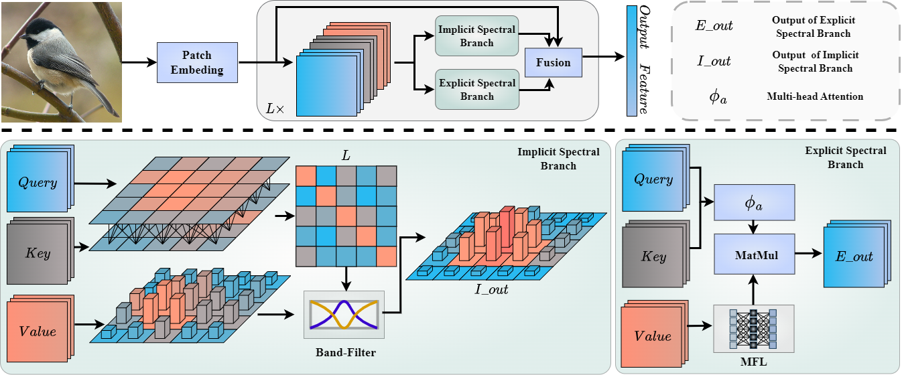

# SIEFormer

Spectral-Interpretable and -Enhanced Transformer for Generalized Category Discovery



## Installation

```shell
$ cd repository
$ pip install -r requirements.txt
```

## Config

Set paths to root and datasets in `config.py`

## Datasets

The datasets we use are:

[CUB-200](https://www.vision.caltech.edu/datasets/cub_200_2011/), [StanfordCars](https://www.kaggle.com/datasets/jessicali9530/stanford-cars-dataset), [Aircraft](https://www.kaggle.com/code/metamath/fgvc-aircraft),  [Herbarium](https://www.kaggle.com/competitions/herbarium-2019-fgvc6/data),[Cifar](), [ImageNet-100](https://www.image-net.org/).

The split of datasets follows [GCD](https://github.com/sgvaze/generalized-category-discovery).

## Checkpoints

We released chechpoints for different datasets for evaluation or further study: [Google Drive](https://drive.google.com/drive/folders/1UvauWCIQ72Xuyw2-Ec5TTGQy3OoI4WhU?usp=drive_link)

## Scripts

**Train the model**

If you wish to train SIEFormer, please run:

```
sh scripts/run_${DATASET_NAME}.sh
```

**Eval the model**
Download the checkpoints and put them in the "checkpoints" folder and run:

```
sh scripts/eval_${DATASET_NAME}.sh
```

## Result

|         | All | Old | New |
| --------   | ------   | ----  |------|
|CIFAR10 | 97.4 | 95.2 | 98.6 |
| CIFAR100 |  83.3  |  84.4  | 81.2 |
| ImageNet-100   | 86.5 | 94.5 | 82.6 |
| CUB-200   | 66.0 | 71.6 | 63.2 |
| Stanford-Cars  | 59.2 | 74.0 | 52.1 |
| FGVC-Aircraft | 53.3 | 50.2 | 49.8 |
| Herbarium19 | 44.5 | 57.2 | 37.6 |

## Acknowledgement

Our codes are based on [Generalized Category Discovery](https://github.com/sgvaze/generalized-category-discovery) and [SimGCD](https://github.com/CVMI-Lab/SimGCD).
